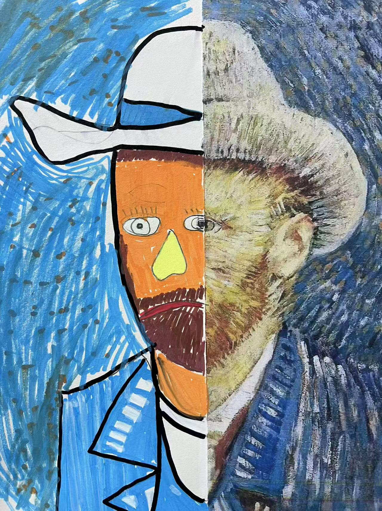
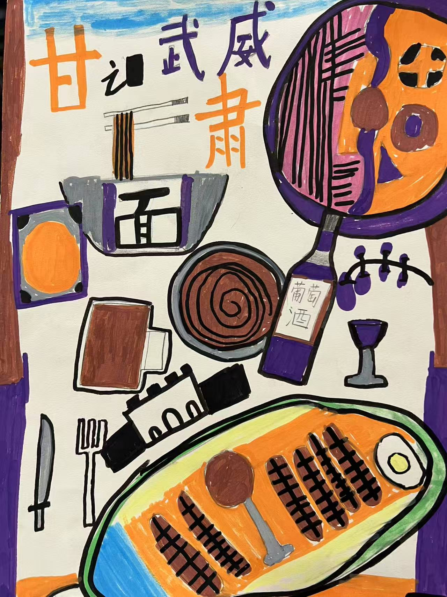
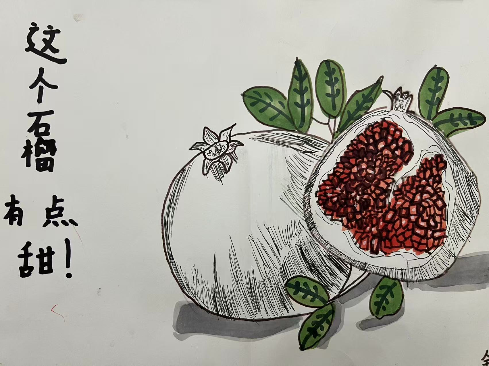
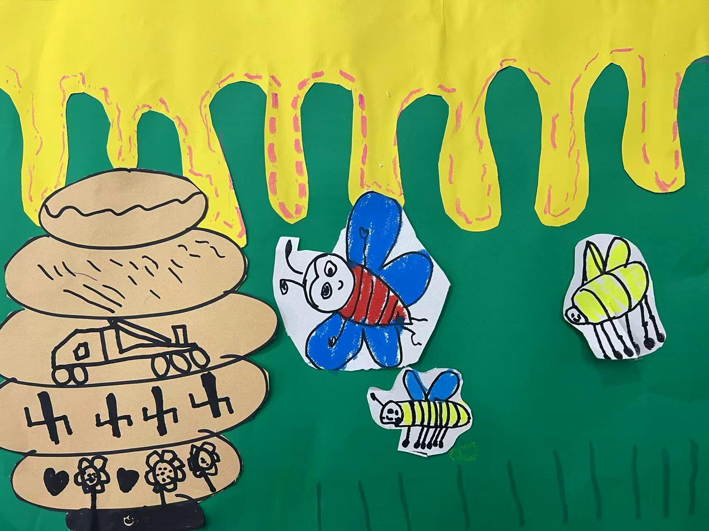

+++
title = "儿童画作"
description = "分享童趣画作"
date = 2026-03-11

[taxonomies]
tags = ["学习", "读书", "儿童作品"]

[extra]
local_image = "learning/babydraw/babydraw_logo.png"
+++

今天下班回到家，孩儿们快乐的争先分享他们的绘画作品，顿时感觉充满乐趣。仔细观赏着作品，越看越欢喜和欣慰。
亮出来一起分享一下。
- 这个就叫做“梵高的一半”吧。

- 这个就叫做“故乡”吧

- 这个石榴有点甜

- 这个叫“贝塔的蜜蜂”吧
