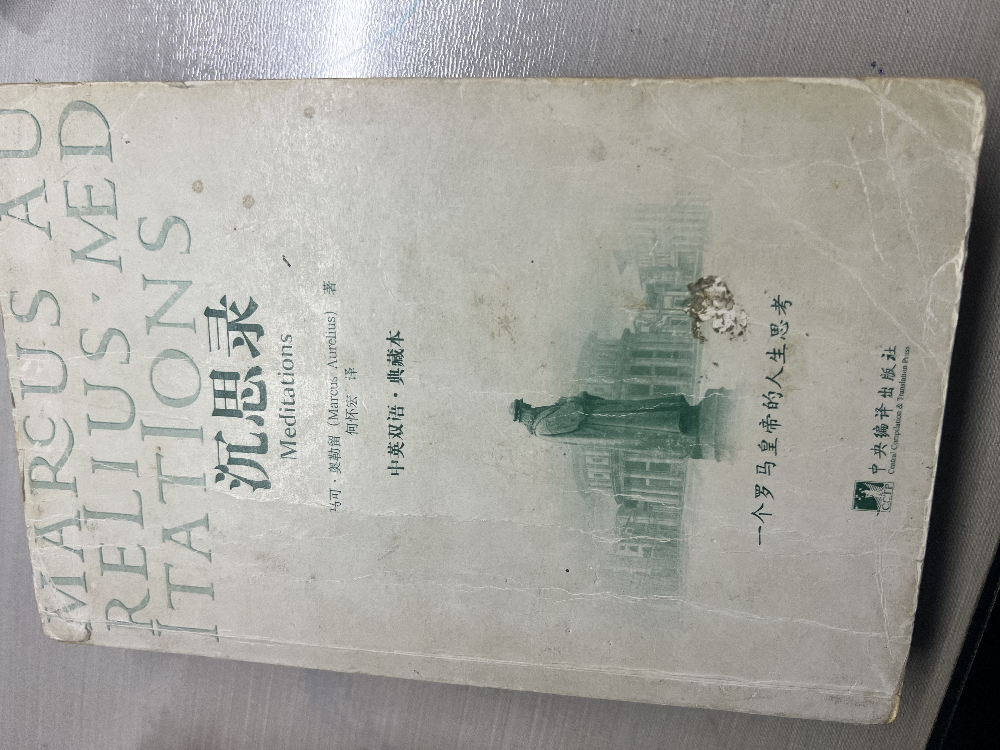

+++
title = "沉思录"
description = "沉思录"
date = 2026-02-26

[taxonomies]
tags = ["学习", "读书","沉思录"]

[extra]
local_image = "learning/meditations/meditations_logo.png"
+++

#### 读第一本书

- 每年开始，还没有把年度书单搞清楚时，就先把这本书读起来。这本书已经陪伴我16年多了（2009年8月1日，当当网购得）。
- 同时这也是我沉心静气最靠谱的一本书，每当节奏繁乱迟迟不能理清楚自己时，读着读着就找回自己的样子了。
- 这本书是中英双语，但是很多次鼓起勇气读英文版时，没几天就坚持不下去了。希望今年可以中英版本都可以读完整。
>翻了一下当当网购买记录，最早的一本书是“新编C语言程序设计教程”，2005年12月18日，那个时候在打信奥赛，也是第一次网购，自己去中国银行开通了网上支付，平邮寄到学校。

