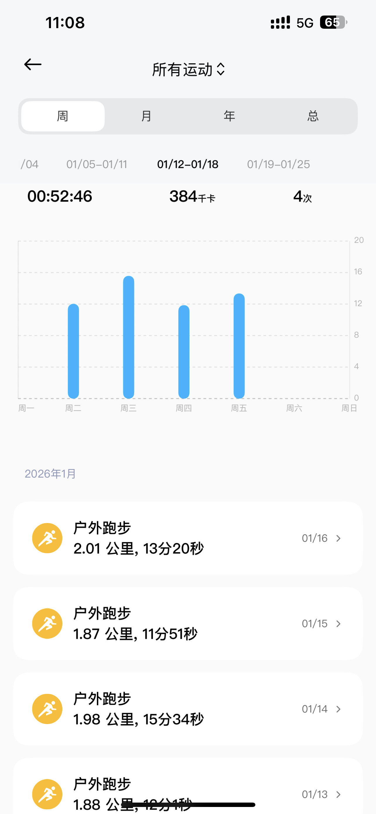

+++
title = "慢慢跑起来"
description = "动起来，无论在哪里跑"
date = 2026-01-12

[taxonomies]
tags = ["运动", "跑步"]

[extra]
local_image = "sports/running/running_logo.png"
+++

## 不管怎么样，先跑起来
> 去年有段时间，跑五公里把脚跑坏了，休息了一段时间。

今年继续开始跑，第一周

